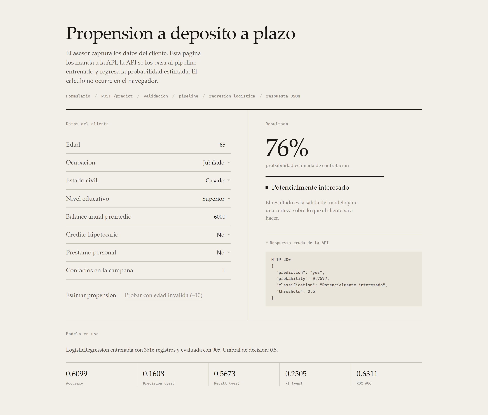
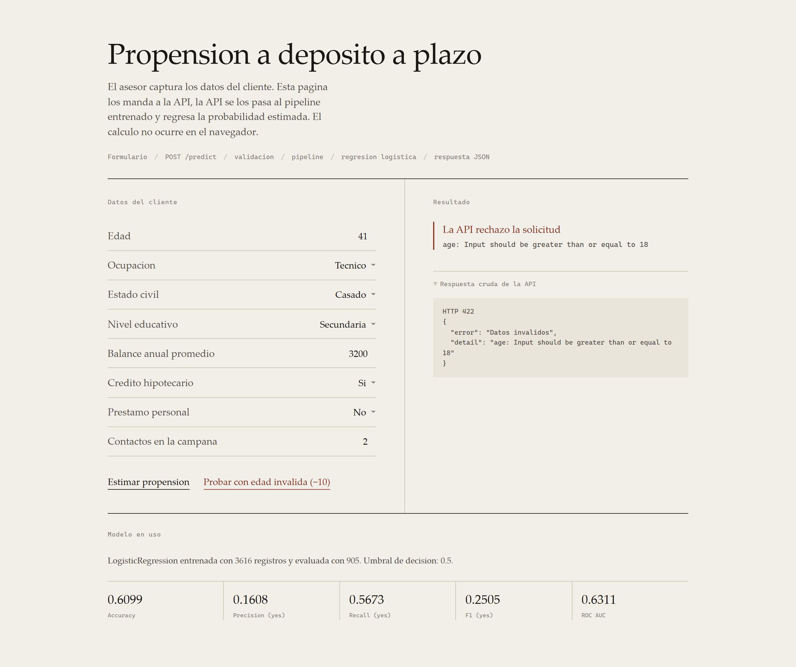

# Propension a deposito a plazo

Estima la probabilidad de que un cliente de banca contrate un deposito a plazo. Dataset Bank Marketing de UCI, regresion logistica, API en FastAPI y una interfaz para capturar los datos.

El ejercicio se trata de mantener separadas las etapas. El modelo se entrena una vez en `training/train.py` y queda guardado en un `.joblib`. La API solo lo carga, y `/predict` no entrena nada.

## Correrlo

Probado con Python 3.14.4 en Windows. En Windows hay dos atajos: `setup.bat` instala, baja el dataset y entrena; `run.bat` levanta la API. A mano:

```bash
python -m venv .venv
.venv\Scripts\activate          # Linux o macOS: source .venv/bin/activate
pip install -r requirements.txt

python training/get_data.py     # baja bank.csv de UCI a data/
python training/train.py        # entrena y guarda el pipeline + metrics.json
uvicorn app.main:app --host 127.0.0.1 --port 8000
```

La interfaz queda en http://127.0.0.1:8000 y la documentacion de FastAPI en `/docs`.

Las pruebas con `python -m pytest tests -q`. Son 12: caso valido, los dos errores de la actividad, catalogo de categorias, campo faltante, rangos y consistencia entre `prediction` y `probability`.

Si `get_data.py` no alcanza a UCI, genera un csv sustituto con el mismo esquema y lo avisa en pantalla. `data/DATA_SOURCE.txt` dice cual de las dos rutas se tomo.

Para servir el frontend aparte, en su propio puerto, `bash scripts/run_frontend.sh`. Se apunta a otra API cambiando `frontend/config.js`.

## Datos

[Bank Marketing](https://archive.ics.uci.edu/dataset/222/bank+marketing), UCI Machine Learning Repository. Se usa `bank.csv`, la muestra del 10%: 4521 registros, de los cuales 11.5% contrato.

Las ocho variables que pide la actividad: `age`, `balance` y `campaign` como numericas, y `job`, `marital`, `education`, `housing`, `loan` como categoricas. La objetivo es `y`.

`duration` no se usa. La razon esta en la pregunta 5.

## Entrenamiento

Split 80/20 estratificado por `y`, `random_state=42`. Las numericas pasan por `StandardScaler` y las categoricas por `OneHotEncoder(handle_unknown="ignore", drop="first")`. Las dos ramas se unen en un `ColumnTransformer` que alimenta a `LogisticRegression(max_iter=1000, class_weight="balanced")`.

Todo eso es un solo objeto `Pipeline`, y es el objeto completo el que se serializa. Por eso la API no transforma nada por su cuenta: recibe las columnas crudas y el artefacto se encarga.

`class_weight="balanced"` es lo que mas mueve los resultados. Sin eso el modelo contesta "no" a todo, saca 88% de accuracy y 0 de recall.

Lo que imprime `train.py`:

```
Metricas sobre el conjunto de prueba
  accuracy   0.6099
  precision  0.1608
  recall     0.5673
  f1         0.2505
  roc_auc    0.6311

Matriz de confusion
                   Pred: no contrata  Pred: contrata
Real: no contrata                493             308
Real: contrata                    45              59
```

### Que dicen esos numeros

La accuracy de 0.610 se ve peor que el 88% de contestar "no" siempre, y aun asi el modelo sirve mas. Con una clase que es el 12% del total, la accuracy premia al que no arriesga.

El recall de 0.567 es el numero que le importa al area comercial: de cada 100 clientes que si habrian contratado, el modelo marca 57. Los otros 43 son gente que hubiera dicho que si y a la que nadie llamo.

La precision de 0.161 significa que de cada 100 marcados, contratan 16. Suena mal hasta que se compara: llamar al azar da 11.5%, asi que la lista convierte 1.40 veces mejor. Ese error se paga en tiempo del asesor, que es mas barato que el otro.

El F1 de 0.251 resume esa tension y con ocho variables demograficas no da para mucho mas.

El AUC de 0.631 mide que tan bien ordena a los clientes de mas a menos probable, sin depender del umbral. Es la mas util aqui, porque el asesor no llama a todos los que dan `yes`: llama a los primeros N de una lista ordenada.

Sobre los coeficientes, el modelo aprendio lo previsible. `loan=yes` (-0.66) y `housing=yes` (-0.52) empujan hacia abajo, o sea que quien ya trae deuda contrata menos. Hacia arriba jalan `job=student` (0.54), `job=retired` (0.41) y `education=tertiary` (0.33). `campaign` sale en -0.25: insistir con mas llamadas baja la probabilidad.

`job=unknown` sale alto (0.55) pero con muy pocos registros atras, asi que no lo tomaria como hallazgo.

Subir el umbral por arriba de 0.5 mejora la precision y sacrifica recall. Es una decision de negocio.

## La API

`POST /predict` recibe las ocho variables y devuelve:

```json
{
  "prediction": "no",
  "probability": 0.4005,
  "classification": "Poco probable",
  "threshold": 0.5
}
```

Tambien hay `GET /health`, `GET /model-info` (metricas y catalogos, de donde el frontend saca sus menus) y `GET /docs`.

La validacion esta en `app/schemas.py` y corre antes de que el dato llegue al modelo. Rechaza por tipo (`age = "hola"`), por rango (`age = -10`, `campaign = 0`) y por catalogo (`job = "ingeniero"`). El minimo de 18 en `age` es regla de negocio, no estadistica: un menor no puede contratar el producto.

Los errores de Pydantic vienen anidados y son incomodos de pintar en pantalla, asi que `app/main.py` los aplana:

```json
{"error": "Datos invalidos", "detail": "age: Input should be greater than or equal to 18"}
```

## Evidencia

Las salidas completas de curl estan en `docs/evidencia/api_curl.txt`.

Inferencia valida, un jubilado con buen balance y sin deudas:

```bash
curl -s -X POST http://127.0.0.1:8000/predict -H "Content-Type: application/json" \
  -d '{"age":68,"job":"retired","marital":"married","education":"tertiary","balance":6000,"housing":"no","loan":"no","campaign":1}'
```
```json
{"prediction":"yes","probability":0.7577,"classification":"Potencialmente interesado","threshold":0.5}
```

El mismo endpoint con un perfil de baja propension devuelve `0.4005` y `"Poco probable"`, o sea que si distingue.

Con datos invalidos:

```bash
curl -s -X POST http://127.0.0.1:8000/predict -H "Content-Type: application/json" \
  -d '{"age":"hola", ...}'      # HTTP 422, "age: Input should be a valid integer"

curl -s -X POST http://127.0.0.1:8000/predict -H "Content-Type: application/json" \
  -d '{"age":-10, ...}'         # HTTP 422, "age: Input should be greater than or equal to 18"
```

En ninguno de los dos se ejecuta el pipeline.



El panel de abajo a la derecha muestra el JSON tal como llego, con su codigo HTTP. Ahi se ve que el 76% en pantalla salio de `/predict` y no de una cuenta en JavaScript. El frontend no tiene coeficientes ni umbrales propios.



El boton de prueba manda `age = -10`, la API responde 422 y la interfaz pinta el mensaje que vino en la respuesta.

La fila de metricas tampoco esta escrita en el HTML. Sale de `/model-info`, o sea del `metrics.json` que dejo el entrenamiento.

## Preguntas

### 1. Por que el modelo se entrena fuera de la API

Por tiempo y por consistencia. Entrenar aqui toma segundos, con un dataset real toma horas, y meterlo dentro de `/predict` haria que cada asesor pague esa espera en cada consulta para llegar siempre al mismo resultado.

Hay un problema mas grave que la lentitud. Si el modelo se reentrena en cada peticion, dos consultas identicas pueden dar respuestas distintas segun como haya caido el split, y entonces nadie puede explicar por que un cliente salio en 0.72 el martes y en 0.61 el miercoles. Teniendo el artefacto por separado se puede versionar, revisar sus metricas antes de publicarlo y volver al anterior si el nuevo sale peor.

### 2. Por que el mismo preprocesamiento en entrenamiento e inferencia

Porque el modelo no aprendio sobre los datos crudos sino sobre los transformados, y sus coeficientes estan en esas unidades.

`StandardScaler` convierte `balance` en `(balance - media) / desviacion` con la media y la desviacion del conjunto de entrenamiento. Son parametros aprendidos. Si en inferencia se manda el balance sin escalar, un 3200 se le presenta al modelo como un cliente absurdamente rico. Con `OneHotEncoder` pasa algo parecido pero con el orden de las columnas: generando las dummies aparte, `job=retired` puede terminar en la posicion que el modelo tenia para `marital=single`.

Ninguna de las dos fallas provoca un error visible. La API responde 200 con una probabilidad que se ve razonable y esta mal. Por eso el preprocesamiento va dentro del `Pipeline` y se guarda junto al clasificador en el mismo archivo.

### 3. Diferencia entre predict() y predict_proba()

`predict_proba()` devuelve lo que el modelo calcula: `[[0.28, 0.72]]`, o sea 28% de que no y 72% de que si. `predict()` compara ese 0.72 contra 0.5 y devuelve la clase.

El 0.5 es una convencion y no un resultado del modelo. Con 12% de clase positiva no hay razon para suponer que sea el mejor corte. Si el banco tiene capacidad para 500 llamadas, lo util es ordenar por probabilidad y llamar a los primeros 500, crucen o no el umbral. Un cliente en 0.49 y otro en 0.05 son casos muy distintos y `predict()` los devuelve iguales. Por eso la respuesta trae las dos cosas, mas el `threshold` que se uso.

### 4. Que significa un 0.72 y que no

Significa que entre los clientes del historico con ese mismo perfil, alrededor del 72% termino contratando. Es una frecuencia estimada sobre un grupo.

Ese numero no expresa una certeza del 72% sobre esa persona en particular, porque describe al grupo en el que el modelo la coloca. Tampoco promete que 100 clientes en 0.72 vayan a dar 72 contrataciones, porque para eso el modelo tendria que estar calibrado y aqui no lo esta: `class_weight="balanced"` infla las probabilidades de la clase positiva, asi que el valor sirve para ordenar clientes y no para presupuestar. El numero tampoco explica nada por si solo, para eso hay que mirar los coeficientes. Y como resume el pasado en vez de predecir el futuro, si cambia el producto o la tasa de interes la relacion que aprendio deja de valer aunque el calculo siga corriendo igual.

### 5. Por que no usar duration

Porque es la duracion de la llamada en segundos, un dato que solo existe despues de haber llamado. El sistema sirve para decidir a quien llamar, asi que cuando el asesor captura los datos ese campo no tendria nada que poner. Y hay fuga de informacion: una llamada larga significa que el cliente estuvo interesado, una de 8 segundos significa que colgo. La variable esta contaminada por el resultado que se quiere predecir. Metiendola, las metricas suben mucho y la mejora es falsa, porque en produccion el dato no existiria. La ficha de UCI hace la misma advertencia.

### 6. Que pasa si manana cambia lo que manda el frontend

Depende del cambio, y la idea es que falle de forma visible.

Si falta un campo, llega con el tipo equivocado o trae un valor fuera de rango, Pydantic corta la peticion y devuelve 422 con el nombre del campo. Una categoria nueva, digamos una ocupacion `freelance`, la rechaza el `Literal` del schema, y si algun dia se abre el catalogo el `handle_unknown="ignore"` del encoder la codifica en ceros en vez de tronar. Los campos de mas simplemente se ignoran.

Hay un cambio que ninguna validacion detecta: que el frontend siga mandando `balance` como numero pero ahora en pesos en vez de euros, o `campaign` contando tambien las campanas anteriores. La estructura sigue siendo valida y los rangos siguen siendo plausibles, asi que la API responde 200 y las predicciones salen mal sin que nadie se entere. Eso solo se detecta monitoreando la distribucion de lo que entra y comparandola contra la del entrenamiento.

Por eso el contrato vive en un solo archivo. `app/schemas.py` lo define, `/docs` lo publica y el frontend arma sus menus con `/model-info` en lugar de traer su propia lista.

---

Ocho variables demograficas no alcanzan para predecir bien esto y el AUC de 0.631 lo refleja. Un modelo de produccion necesitaria por lo menos el historial de campanas previas y algo de estacionalidad. El servicio tampoco tiene autenticacion ni guarda registro de las inferencias que va haciendo, cosa que haria falta para monitorearlo.

Moro, S., Rita, P. y Cortez, P. (2014). Bank Marketing. UCI Machine Learning Repository. https://doi.org/10.24432/C5K306
